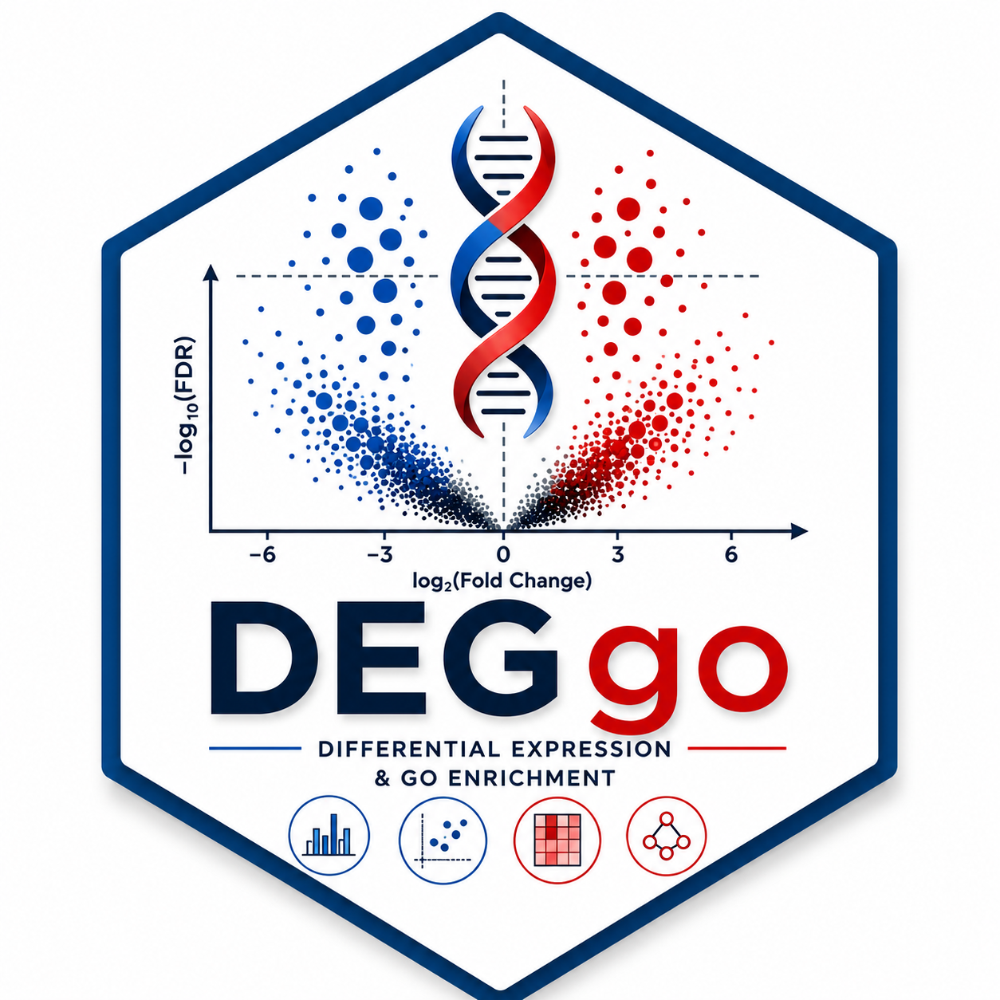
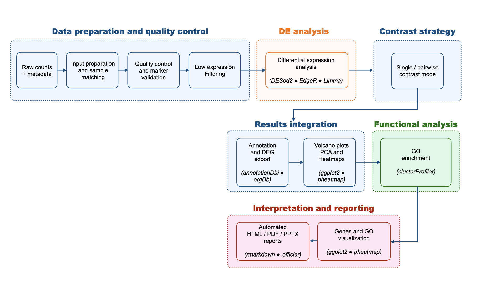

```{r setup, include=FALSE}

knitr::opts_chunk$set(
  collapse = TRUE,
  comment = "#>",
  eval = FALSE
)

```


<p align="center">
  
  
  <a href="https://doi.org/10.5281/zenodo.20785178">
    
  </a>
  
</p>

<p align="center">
  
</p>

## Overview

DEGgo is an R package for automated bulk RNA-seq downstream analysis.

It provides an end-to-end workflow from raw count matrices and sample metadata to:

* quality control;
* sample validation;
* differential expression analysis;
* Gene Ontology enrichment;
* publication-ready visualizations;
* automated HTML/PDF reporting.

DEGgo supports DESeq2, edgeR, and limma and is designed for both bioinformaticians and experimental biologists.

## Workflow

<p align="center">
  
</p>


## Installation

```{r installation}

install.packages("remotes")
remotes::install_github("ymbouamboua/DEGgo")

```

```{r load-package}

library(DEGgo)

```

## Quick start

### Example dataset: airway

DEGgo provides a small DEGgo-ready example dataset derived from the Bioconductor
`airway` package. This dataset contains human RNA-seq count data from airway
smooth muscle cells treated with dexamethasone.

```{r eval=FALSE}

counts <- read.delim(
  system.file("extdata", "airway_counts.tsv", package = "DEGgo"),
  check.names = FALSE
)

metadata <- read.delim(
  system.file("extdata", "airway_metadata.tsv", package = "DEGgo"),
  check.names = FALSE
)

metadata$condition <- metadata$dex

results <- run_deggo(
  counts = counts,
  metadata = metadata,
  gene_col = "gene_id",
  organism = "human",
  sample_col = "Run",
  method = "DESeq2",
  analysis_mode = "single",
  design_formula = ~ cell + dex,
  contrast = c("dex", "trt", "untrt"),
  output_dir = "DEGgo_airway",
  generate_report = TRUE,
  report_formats = "html"
)

results$summary

```


The analysis generates differential expression results, significant DEG tables,
volcano plots, PCA plots, heatmaps, Gene Ontology enrichment results, and an
HTML report in the DEGgo_airway directory.

## Main functions

| Function | Description |
|:----------|:------------|
| `check_raw_counts()` | Validate raw count matrices and sample identifiers before analysis |
| `explore_bulk_rnaseq()` | Raw and cleaned RNA-seq quality control |
| `remove_flagged_samples()` | Remove failed or low-quality samples |
| `marker_score_check()` | Tissue marker scoring and sample swap detection |
| `plot_gene_heatmap()` | Marker or selected-gene heatmap |
| `run_deggo()` | Main DEGgo differential expression workflow |
| `run_go_enrichment()` | Gene Ontology enrichment for DEG results |
| `plot_go_terms()` | Publication-ready GO enrichment plots |
| `plot_all_go_terms()` | Plot GO terms across multiple comparisons |
| `extract_expression()` | Extract raw, normalized, log2-normalized or VST expression values |
| `plot_gene_expression()` | Plot gene expression for selected genes |
| `plot_heatmap()` | Generate DEG heatmaps from differential expression results |
| `plot_pca()` | Principal component analysis of RNA-seq samples |
| `plot_volcano()` | Volcano plot visualization of differential expression results |
| `generate_deggo_report()` | Generate HTML/PDF DEGgo reports |
| `deggo_extract_deg_genes()` | Extract genes of interest from DEG results |
| `deggo_extract_go_genes()` | Extract genes associated with enriched GO terms |
| `deggo_extract_go_genes_pairwise()` | Extract GO-associated genes across pairwise comparisons |
| `deggo_extract_go_keywords()` | Extract GO terms matching biological keywords |
| `run_sample_qc()` | Automated sample-level quality control metrics and diagnostics |

## Supported organisms

DEGgo provides built-in annotation support for the following organisms:

| Organism | Parameter | OrgDb package |
|:----------|:----------|:--------------|
| Human (*Homo sapiens*) | `"human"` | `org.Hs.eg.db` |
| Mouse (*Mus musculus*) | `"mouse"` | `org.Mm.eg.db` |
| Rat (*Rattus norvegicus*) | `"rat"` | `org.Rn.eg.db` |


Custom organisms are supported through user-supplied Bioconductor OrgDb annotation databases.

## Documentation

The complete DEGgo tutorial and advanced workflows are available in the package vignette:

```{r eval=FALSE}

browseVignettes("DEGgo")

```


## Citation

If you use DEGgo, please cite:

Yvon Mbouamboua, Vicent Prevot and Paolo Giacobini. (2026). DEGgo: automated bulk RNA-seq differential expression analysis and Gene Ontology enrichment. Zenodo. https://doi.org/10.5281/zenodo.20785178


# License

MIT © Yvon MBOUAMBOUA
