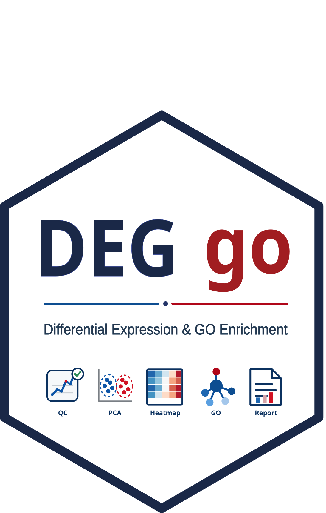
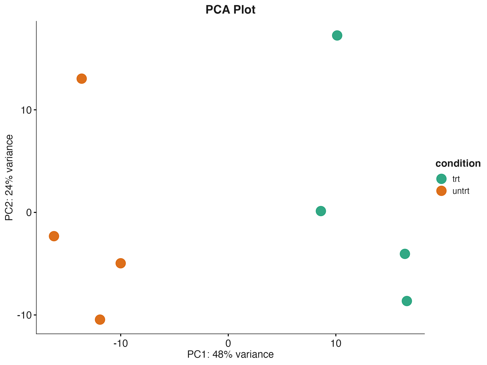
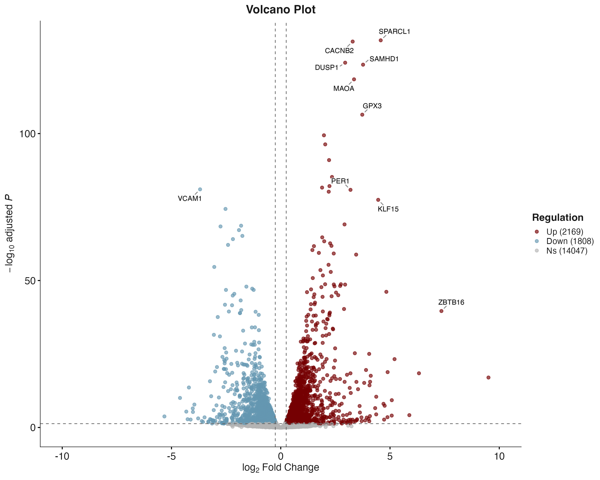
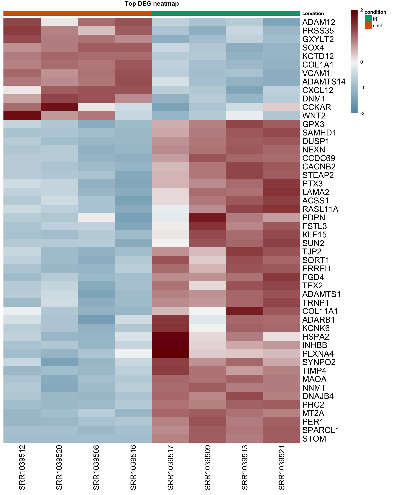
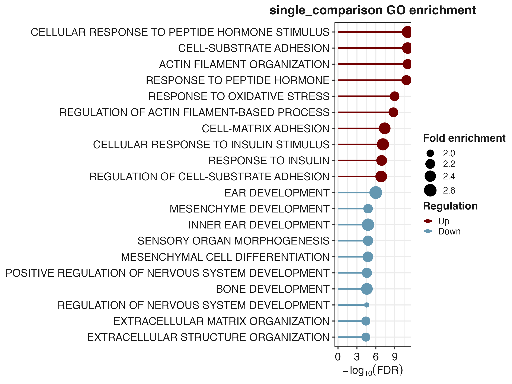
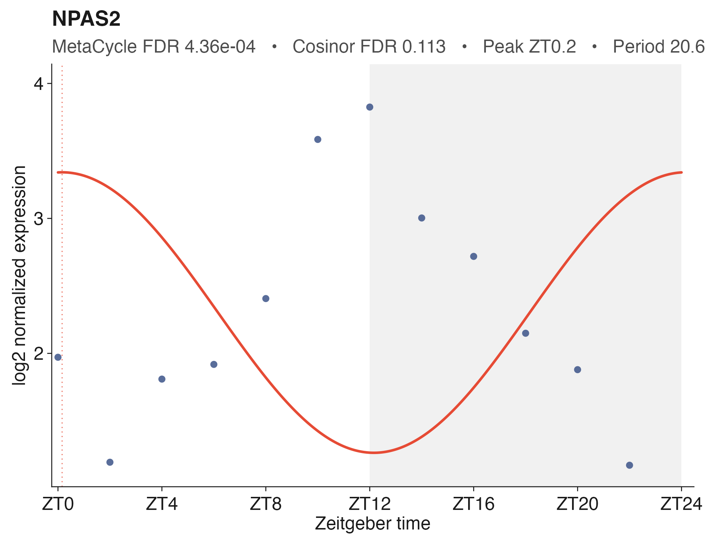
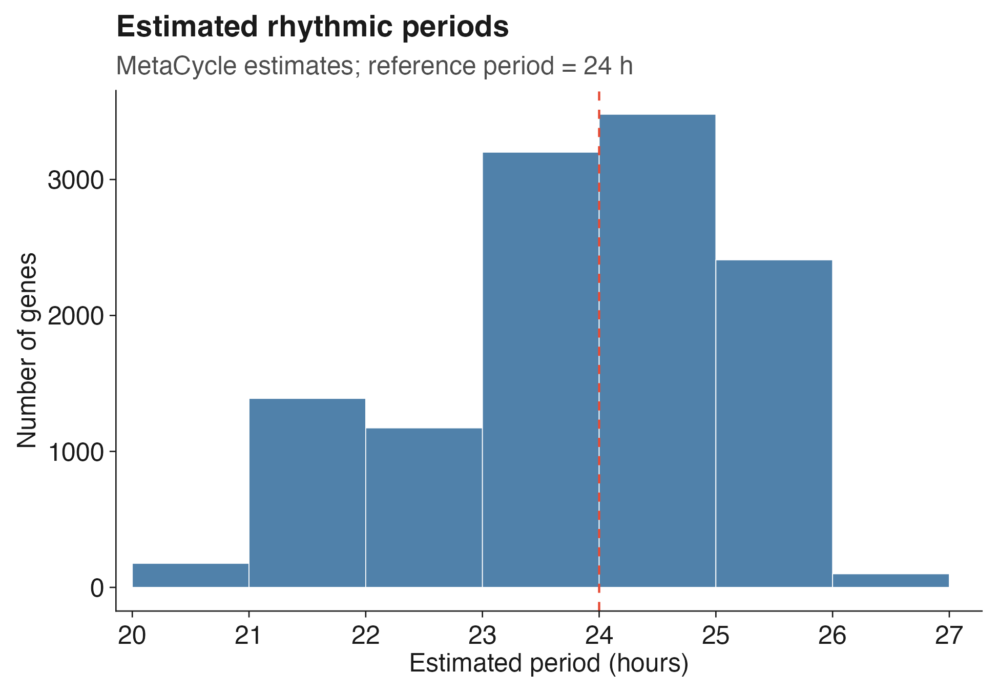

```{r setup, include=FALSE}
knitr::opts_chunk$set(
  collapse = TRUE,
  comment = "#>",
  eval = FALSE
)
```

<div align="center">



<br><br>

<strong>
An integrated R framework for automated bulk RNA-seq differential expression,
experimental design assessment, functional enrichment, circadian rhythmicity
analysis, and reproducible reporting.
</strong>

</div>

<!-- badges: start -->

<p align="center">

[](https://github.com/ymbouamboua/DEGgo/actions/workflows/R-CMD-check.yaml)
[](https://ymbouamboua.github.io/DEGgo/)
[](https://doi.org/10.5281/zenodo.20785178)

[](LICENSE)


</p>

<!-- badges: end -->

📖 **Documentation:** https://ymbouamboua.github.io/DEGgo/

---

## Highlights

- Experimental design assessment with `design_qc()`
- Automated recommendations for DESeq2 or `dream`
- One-command bulk RNA-seq differential expression workflow
- DESeq2, edgeR, limma, and variancePartition/dream support
- Single and automated pairwise analyses
- Gene Ontology enrichment
- Circadian rhythmicity analysis with MetaCycle and cosinor regression
- Publication-quality figures
- HTML, PDF, and PowerPoint reports
- Reproducibility files and structured output directories

## Workflow

```text
Raw counts + metadata
          │
          ▼
 Experimental design QC
          │
          ├── PCA variance assessment
          ├── PERMANOVA
          ├── batch-factor assessment
          ├── repeated-unit detection
          └── method recommendation
          │
          ▼
 Input validation
          │
          ▼
 Sample QC
          │
          ▼
 Expression filtering
          │
          ▼
 Differential expression
          │
          ├── PCA
          ├── Volcano
          ├── Heatmap
          ├── GO enrichment
          └── Reports
          │
          ▼
 Optional circadian analysis
          ├── MetaCycle
          ├── Cosinor
          ├── Differential rhythmicity
          └── Publication figures
```

The main analysis steps are:

1. Experimental design assessment
2. Input validation
3. Quality control
4. Expression filtering
5. Differential expression
6. PCA, volcano plots, and heatmaps
7. Gene Ontology enrichment
8. Automated reports
9. Reproducibility export
10. Optional rhythmicity analysis

## Gallery

| PCA | Volcano |
|:---:|:---:|
|  |  |

| Heatmap | GO |
|:---:|:---:|
|  |  |

| Rhythm | Period |
|:---:|:---:|
|  |  |

## Installation

```r
install.packages("remotes")

remotes::install_github(
  "ymbouamboua/DEGgo"
)

library(DEGgo)
```

Optional rhythmicity dependencies:

```r
install.packages(
  c(
    "MetaCycle",
    "cosinor",
    "cosinor2"
  )
)
```

## Quick start

### Input data

#### Count table

DEGgo accepts raw count tables, data frames, or matrices. A tabular count
object may contain one gene identifier column and one column per sample.

```text
gene_id          gene_name    Sample1    Sample2    Sample3
ENSG00000000003  TSPAN6       120        145        98
ENSG00000000005  TNMD         65         80         50
ENSG00000000419  DPM1         12         18         250
```

For count matrices, genes should be stored in rows, samples in columns, and
gene identifiers in unique row names.

#### Metadata

Metadata must contain one row per sample. The sample identifier column is
specified with `sample_col`.

```text
sample      treatment    batch
Sample1     control      A
Sample2     treated      A
Sample3     control      B
```

Sample identifiers in the metadata must match the sample columns in the count
table.

## Experimental design assessment

Before differential expression analysis, `design_qc()` can be used to assess
the experimental structure and identify factors that dominate global
expression variation.

The function:

- validates counts and metadata;
- transforms the count matrix using VST, rlog, or log-CPM;
- evaluates principal-component variation;
- optionally runs PERMANOVA;
- assesses treatment, batch, tissue, sex, donor, cage, or other design factors;
- detects repeated experimental units when `unit_col` is supplied;
- recommends either DESeq2 or `dream` based on the detected structure.

### Basic design assessment

```{r design-qc}
counts <- readtbl(
  file.path(
    root,
    "data",
    "processed",
    "clean_counts.tsv"
  )
)

metadata <- readtbl(
  file.path(
    root,
    "data",
    "processed",
    "clean_metadata.tsv"
  )
)

design_res <- design_qc(
  counts = counts,
  metadata = metadata,
  sample_col = "sample",
  group_col = "treatment",
  batch_cols = c(
    "sex",
    "tissue"
  ),
  transform = "vst",
  run_permanova = TRUE
)
```

Example output:

```text
DEGgo DesignQC
--------------------------------------------------
Samples:             60
Groups:              2
Independent units:   not specified/detected
Repeated units:      no
Dominant factor:     tissue
Recommended method:  DESeq2
Reason:              No repeated experimental unit was specified or detected.
```

This indicates that tissue explains more global expression variation than the
treatment factor, but the samples are treated as independent because no valid
experimental-unit column was supplied.

### Repeated-measures designs

Use `unit_col` only when the column contains a genuine, globally unique
experimental-unit identifier, such as:

- patient ID;
- donor ID;
- animal ID;
- dam or litter ID;
- cage ID;
- subject ID measured repeatedly across time or treatment.

```r
design_res <- design_qc(
  counts = counts,
  metadata = metadata,
  sample_col = "sample",
  group_col = "treatment",
  batch_cols = c(
    "sex",
    "tissue"
  ),
  unit_col = "animal_id",
  transform = "vst",
  run_permanova = TRUE
)
```

Example output:

```text
DEGgo DesignQC
--------------------------------------------------
Samples:             17
Groups:              2
Independent units:   8 (cage)
Repeated units:      yes
Dominant factor:     cage
Recommended method:  dream
Reason:              Multiple samples share each cage; treating all samples as independent would create pseudoreplication, and cage dominates the assessed PCA structure.

Warnings:
  - Experimental unit auto-detected as 'cage'. Verify this choice; explicit unit_col is safer.
```

When the same experimental unit contributes samples to several groups or
conditions, DEGgo may recommend `dream`.

Do not use replicate numbers such as `1`, `2`, `3`, `4`, and `5` as
`unit_col` when those numbers are reused independently across treatments,
sexes, tissues, cohorts, or experiments.

### Interpreting method recommendations

| Design structure | Typical recommendation |
|:-----------------|:-----------------------|
| Independent biological replicates | DESeq2 |
| Independent groups with known fixed batch factors | DESeq2 |
| Repeated measurements from the same donor or animal | dream |
| Several tissues from the same individual in one joint model | dream |
| Longitudinal or paired observations | dream |
| Replicate numbers reused across unrelated samples | Do not use as `unit_col` |

The recommendation is diagnostic guidance. The final model should always
reflect the biological experimental unit and the scientific comparison.

## Example analysis with the airway dataset

The package includes a ready-to-use RNA-seq dataset derived from the
Bioconductor **[airway](https://bioconductor.org/packages/airway/)** package
(Himes *et al.*), providing a reproducible example for testing and learning
the complete DEGgo workflow.

```{r airway-data}
counts <- read.delim(
  system.file(
    "extdata",
    "airway_counts.tsv",
    package = "DEGgo"
  ),
  check.names = FALSE
)

metadata <- read.delim(
  system.file(
    "extdata",
    "airway_metadata.tsv",
    package = "DEGgo"
  ),
  check.names = FALSE
)

metadata$treatment <- factor(
  metadata$treatment,
  levels = c(
    "untreated",
    "treated"
  )
)
```

### Assess the design

```{r airway-design-qc}
design_res <- design_qc(
  counts = counts,
  metadata = metadata,
  sample_col = "sample",
  group_col = "treatment",
  transform = "vst",
  run_permanova = TRUE
)
```

### Single differential expression analysis

```{r single-analysis}
results <- run_deggo(
  counts = counts,
  metadata = metadata,
  sample_col = "sample",
  organism = "human",
  method = "DESeq2",
  design_formula = ~ treatment,
  contrast = c(
    "treatment",
    "treated",
    "untreated"
  )
)
```

The comparison is interpreted as:

```text
treated versus untreated
```

Therefore, positive `log2FoldChange` values represent higher expression in
the treated group.

## Pairwise differential expression analysis

DEGgo supports automated pairwise differential expression analysis across
multiple experimental groups.

This example generates a reproducible synthetic RNA-seq dataset containing
two experimental factors:

- treatment: control versus treated;
- sex: male versus female.

Each combination contains three independent biological replicates.

```{r synthetic-data}
set.seed(123)

metadata <- expand.grid(
  treatment = c(
    "control",
    "treated"
  ),
  sex = c(
    "male",
    "female"
  ),
  replicate = seq_len(3),
  stringsAsFactors = FALSE
)

metadata$sample <- paste0(
  "S",
  seq_len(nrow(metadata))
)

metadata$group <- interaction(
  metadata$treatment,
  metadata$sex,
  sep = "_",
  drop = TRUE
)

metadata <- metadata[
  ,
  c(
    "sample",
    "treatment",
    "sex",
    "replicate",
    "group"
  )
]

n_genes <- 1000

counts <- matrix(
  rnbinom(
    n_genes * nrow(metadata),
    mu = 100,
    size = 1
  ),
  nrow = n_genes,
  ncol = nrow(metadata)
)

rownames(counts) <- paste0(
  "ENSG",
  sprintf(
    "%011d",
    seq_len(n_genes)
  )
)

colnames(counts) <- metadata$sample

# Introduce artificial differential expression

counts[
  1:50,
  metadata$group == "treated_male"
] <- counts[
  1:50,
  metadata$group == "treated_male"
] * 4

counts[
  51:100,
  metadata$group == "treated_female"
] <- counts[
  51:100,
  metadata$group == "treated_female"
] * 3

counts <- data.frame(
  gene_id = rownames(counts),
  counts,
  check.names = FALSE
)
```

### Assess the pairwise design

The replicate column in this synthetic example is only a within-group
replicate label. Because values are reused across unrelated groups, it should
not be supplied as `unit_col`.

```{r pairwise-design-qc}
design_res <- design_qc(
  counts = counts,
  metadata = metadata,
  sample_col = "sample",
  group_col = "group",
  batch_cols = "sex",
  transform = "vst",
  run_permanova = TRUE
)
```

### Define pairwise comparisons

```{r pairwise-contrasts}
pairwise_contrasts <- list(
  treated_vs_control_male = c(
    "group",
    "treated_male",
    "control_male"
  ),

  treated_vs_control_female = c(
    "group",
    "treated_female",
    "control_female"
  ),

  male_vs_female_control = c(
    "group",
    "control_male",
    "control_female"
  ),

  male_vs_female_treated = c(
    "group",
    "treated_male",
    "treated_female"
  )
)
```

### Run pairwise DEGgo

```{r pairwise-analysis}
results <- run_deggo(
  counts = counts,
  metadata = metadata,

  organism = "human",
  method = "DESeq2",
  analysis_mode = "pairwise",

  sample_col = "sample",
  design_formula = ~ group,

  pairwise_group_cols = c(
    "treatment",
    "sex"
  ),

  pairwise_contrast_col = "group",
  pairwise_contrasts = pairwise_contrasts,

  output_dir = "DEGgo_pairwise_results"
)
```

The workflow performs each requested comparison independently and generates:

- differential expression tables;
- PCA plots;
- volcano plots;
- clustered heatmaps;
- Gene Ontology enrichment analyses;
- automated reports;
- reproducibility files.

For a contrast such as:

```r
c(
  "group",
  "treated_male",
  "control_male"
)
```

positive `log2FoldChange` values indicate higher expression in treated males,
whereas negative values indicate higher expression in control males.

## Repeated-measures analysis with dream

For paired, longitudinal, donor-aware, or repeated-tissue experiments, DEGgo
supports `variancePartition::dream`.

A valid repeated-measures model requires a true experimental-unit identifier.

```{r dream-analysis}
results <- run_deggo(
  counts = counts,
  metadata = metadata,

  sample_col = "sample",
  organism = "mouse",

  method = "dream",
  analysis_mode = "single",

  design_formula = ~ treatment + tissue + (1 | animal_id),

  contrast = c(
    "treatment",
    "PAMH",
    "PBS"
  ),

  dream_ddf = "adaptive",
  dream_n_cores = 4,

  output_dir = "DEGgo_dream_results"
)
```

Here, `animal_id` must uniquely identify the animal from which repeated
samples were collected.

## Output structure

The `run_deggo()` workflow organizes results into a structured project
directory.

```text
DEGgo_results/
├── qc/
│   ├── raw_qc/
│   ├── filtered_qc/
│   └── sample_qc_summary.tsv
├── differential_expression/
│   ├── all_genes.tsv
│   ├── significant_genes.tsv
│   └── DEG_summary.tsv
├── pca/
│   ├── PCA.png
│   ├── PCA.pdf
│   └── PCA_coordinates.tsv
├── volcano/
│   ├── Volcano.png
│   ├── Volcano.pdf
│   └── Volcano_data.tsv
├── heatmap/
│   ├── Heatmap.png
│   ├── Heatmap.pdf
│   └── Heatmap_matrix.tsv
├── go_enrichment/
│   ├── GO_results.tsv
│   ├── GO_dotplot.png
│   └── GO_summary.tsv
├── reports/
│   ├── DEGgo_report.html
│   ├── DEGgo_report.pdf
│   └── DEGgo_summary.pptx
├── reproducibility/
│   ├── run_parameters.tsv
│   ├── session_info.txt
│   ├── package_versions.tsv
│   └── analysis_manifest.tsv
└── logs/
    └── DEGgo.log
```

The exact contents depend on the selected analysis method, analysis mode, and
optional downstream analyses.

Supported differential expression methods include:

- `DESeq2`;
- `edgeR`;
- `limma`;
- `dream`.

Supported analysis modes include:

- `single`;
- `pairwise`.

## Public circadian example

DEGgo includes a fully reproducible workflow based on the public baboon
transcriptomic atlas **GSE98965** from Mure *et al.* (Science, 2018).

```{r public-circadian}
results <- run_public_circadian_example(
  tissue_code = "LIV",
  output_dir = "Circadian_results"
)
```

## Rhythmicity analysis

`run_deggo_rhythmicity()` detects rhythmic genes in circadian or periodic
time-course experiments using MetaCycle, cosinor regression, or both.

```{r rhythmicity}
rhythm_results <- run_deggo_rhythmicity(
  expr = expression_matrix,
  metadata = metadata,
  sample_col = "sample",
  time_col = "time",
  assay = "log2_normalized",
  methods = c(
    "meta2d",
    "cosinor"
  ),
  period_range = c(
    20,
    28
  ),
  cycle_length = 24,
  padj_cutoff = 0.05,
  output_dir = "DEGgo_rhythmicity_results"
)
```

### Rhythmicity output files

```text
DEGgo_rhythmicity_results/
├── plots/
│   ├── rhythmicity_period_distribution.png
│   ├── rhythmicity_pvalue_comparison.png
│   └── individual_genes/
├── results/
│   ├── metacycle_results.tsv
│   ├── cosinor_results.tsv
│   ├── cosinor_differential_rhythmicity.tsv
│   └── rhythmicity_summary.tsv
└── reproducibility/
```

## Main functions

| Function | Description |
|:---------|:------------|
| `design_qc()` | Assess experimental structure, dominant factors, repeated units, and the most appropriate differential expression method |
| `run_deggo()` | Run the complete bulk RNA-seq differential expression workflow |
| `run_deggo_rhythmicity()` | Detect rhythmic genes using MetaCycle and cosinor regression |
| `check_raw_counts()` | Validate raw count matrices and sample identifiers before analysis |
| `explore_bulk_rnaseq()` | Perform exploratory quality control on raw RNA-seq data |
| `remove_flagged_samples()` | Remove low-quality samples identified during quality control |
| `marker_score_check()` | Assess marker gene expression for biological sample validation |
| `run_sample_qc()` | Perform post-filtering sample quality control and diagnostics |
| `run_go_enrichment()` | Perform Gene Ontology over-representation analysis |
| `plot_go_terms()` | Generate publication-ready Gene Ontology enrichment plots |
| `plot_all_go_terms()` | Compare Gene Ontology enrichment across multiple analyses |
| `extract_expression()` | Extract raw, normalized, log2-normalized, or VST expression values |
| `plot_gene_expression()` | Visualize selected genes across biological groups |
| `plot_gene_heatmap()` | Visualize marker or selected genes as a heatmap |
| `plot_heatmap()` | Generate heatmaps of differentially expressed genes |
| `plot_pca()` | Perform principal-component analysis |
| `plot_volcano()` | Generate publication-ready volcano plots |
| `generate_deggo_report()` | Generate an automated HTML or PDF analysis report |
| `generate_deggo_pptx()` | Generate a PowerPoint summary report |
| `deggo_extract_deg_genes()` | Extract selected genes from differential expression results |
| `deggo_extract_go_genes()` | Extract genes associated with enriched Gene Ontology terms |
| `deggo_extract_go_genes_pairwise()` | Extract GO-associated genes across pairwise comparisons |
| `deggo_extract_go_keywords()` | Search enriched Gene Ontology terms using biological keywords |

## Supported organisms

DEGgo provides built-in annotation support for the following organisms:

| Organism | Parameter | OrgDb package |
|:---------|:----------|:--------------|
| Human (*Homo sapiens*) | `"human"` | `org.Hs.eg.db` |
| Mouse (*Mus musculus*) | `"mouse"` | `org.Mm.eg.db` |
| Rat (*Rattus norvegicus*) | `"rat"` | `org.Rn.eg.db` |

Additional organisms can be analyzed by supplying a compatible Bioconductor
`OrgDb` annotation database.

Rhythmicity analysis itself does not require an `OrgDb` package when the
expression matrix already contains suitable gene identifiers. A custom
annotation table can be provided through `gene_annotation`.

## Documentation

A complete tutorial and advanced examples are available in the package
vignettes.

```{r vignette}
browseVignettes("DEGgo")
```

## Roadmap

### Current

- Experimental design assessment
- Differential expression
- Pairwise analysis
- Repeated-measures analysis with dream
- GO enrichment
- Rhythmicity analysis
- HTML and PDF reports
- PowerPoint export
- Reproducibility files

### Planned

- KEGG
- GSEA
- Reactome
- MSigDB
- WGCNA
- Time-series clustering

## Citation

If you use DEGgo, please cite the Zenodo release:

https://doi.org/10.5281/zenodo.20785178

## Contributing

Bug reports, feature requests, and pull requests are welcome.

## License

MIT © Yvon MBOUAMBOUA
