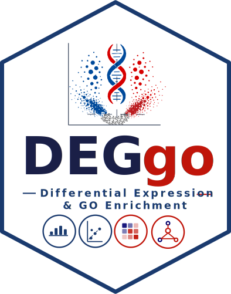
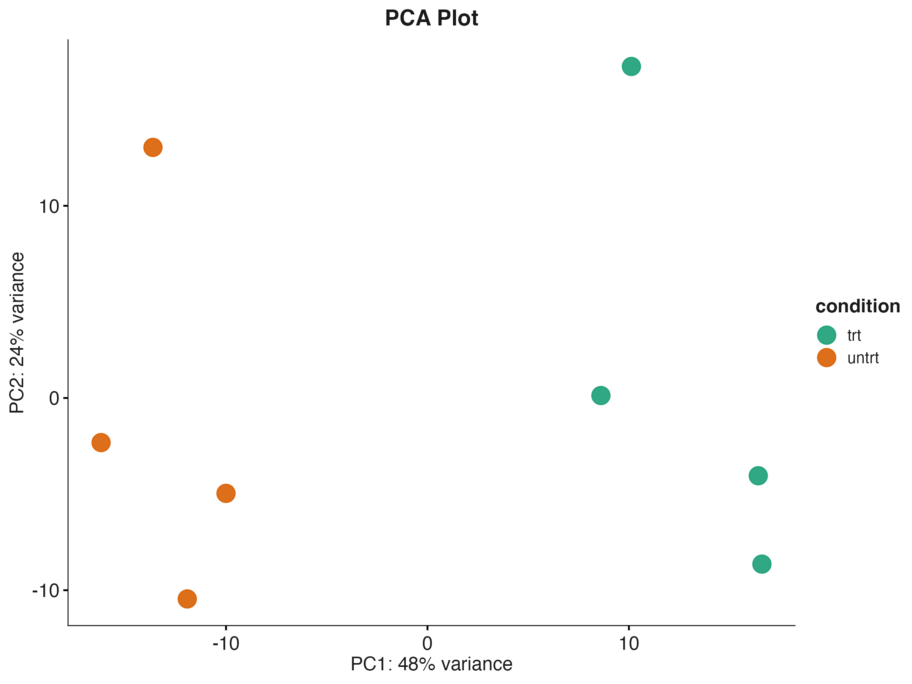
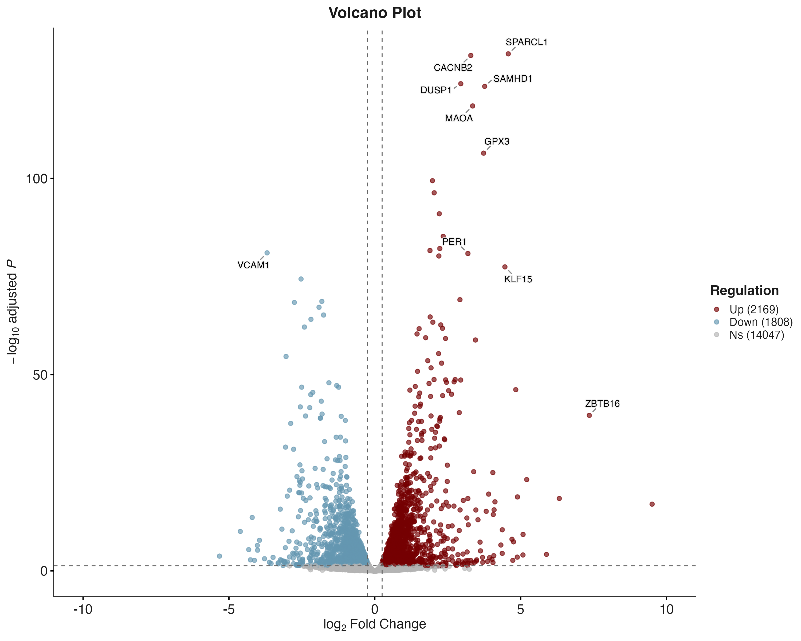
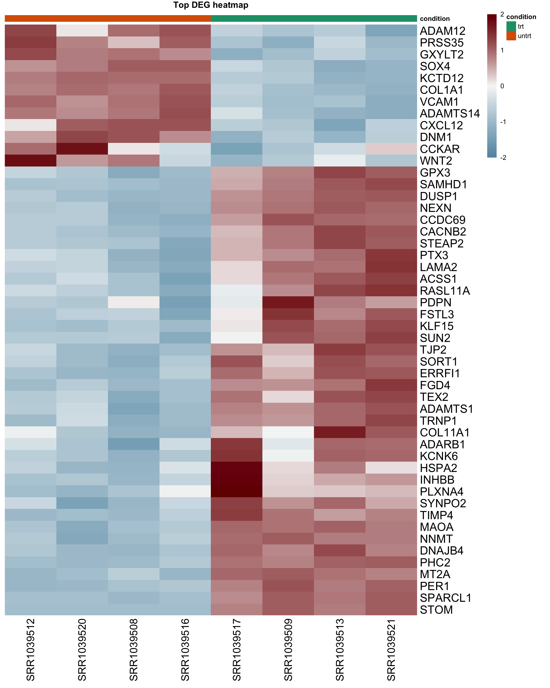
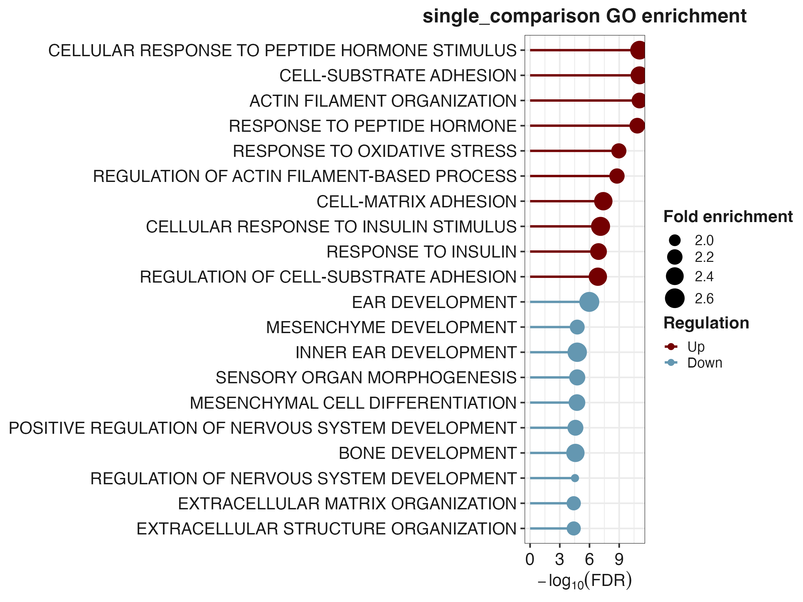
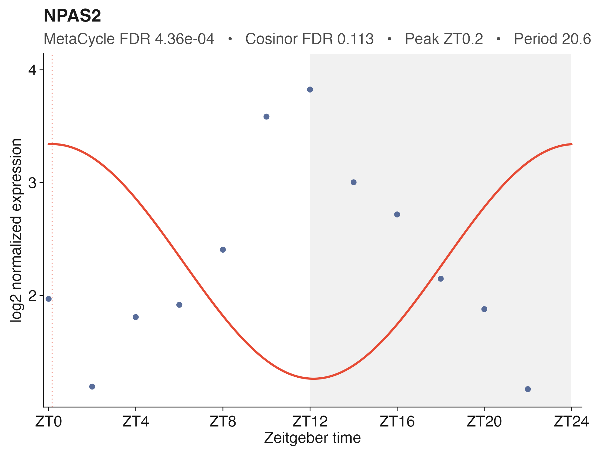
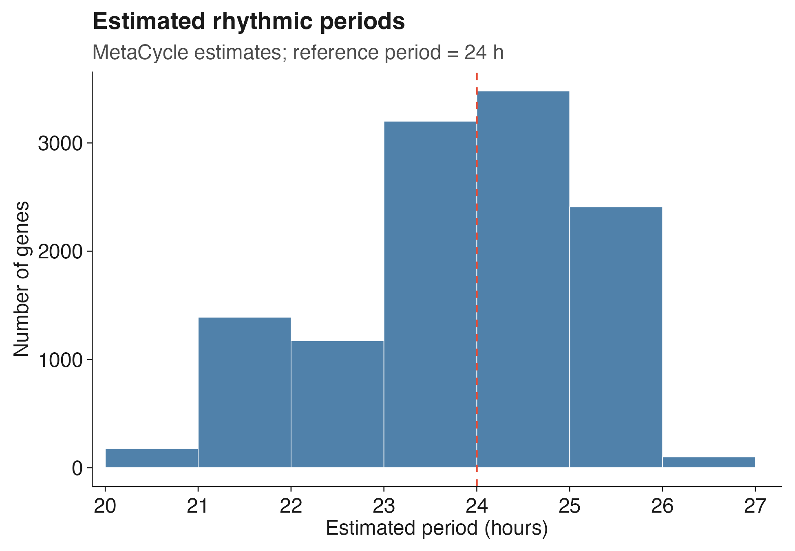

DEGgo
================

<p align="center">



**An integrated framework for automated bulk RNA-seq differential
expression, functional enrichment, circadian rhythmicity analysis, and
reproducible reporting.**

</p>


## Highlights

- One-command RNA-seq workflow
- DESeq2, edgeR and limma
- GO enrichment
- Circadian rhythmicity (MetaCycle + Cosinor)
- Publication-quality figures
- HTML, PDF and PowerPoint reports
- Reproducible analyses

## Workflow

    Raw counts
          │
          ▼
     Input validation
          │
          ▼
     Sample QC
          │
          ▼
     Expression filtering
          │
          ▼
     Differential expression
          │
          ├── PCA
          ├── Volcano
          ├── Heatmap
          ├── GO
          └── Reports
          │
          ▼
     Circadian analysis
          ├── MetaCycle
          ├── Cosinor
          ├── Differential rhythmicity
          └── Publication figures

1.  Input validation
2.  Quality control
3.  Expression filtering
4.  Differential expression
5.  PCA / Volcano / Heatmap
6.  GO enrichment
7.  Reports
8.  Reproducibility
9.  Optional rhythmicity analysis

## Gallery

|           PCA            |           Volcano            |
|:------------------------:|:----------------------------:|
|  |  |

|           Heatmap            |              GO              |
|:----------------------------:|:----------------------------:|
|  |  |

|               Rhythm                |                Period                 |
|:-----------------------------------:|:-------------------------------------:|
|  |  |

## Installation

``` r
install.packages("remotes")
remotes::install_github("ymbouamboua/DEGgo")
library(DEGgo)
```

Optional:

``` r
install.packages(c("MetaCycle","cosinor","cosinor2"))
```

## Quick Start

The package includes a ready-to-use RNA-seq dataset derived from the
Bioconductor **[airway](https://bioconductor.org/packages/airway/)**
package (Himes *et al.*), providing a reproducible example for testing
and learning the complete DEGgo workflow.

``` r
counts <- read.delim(
  system.file(
    "extdata",
    "airway_counts.tsv",
    package = "DEGgo"
  ),
  check.names = FALSE
)

metadata <- read.delim(
  system.file(
    "extdata",
    "airway_metadata.tsv",
    package = "DEGgo"
  ),
  check.names = FALSE
)
```

### Single differential expression analysis

``` r
results <- run_deggo(
  counts=counts,
  metadata=metadata,
  organism="human",
  method="DESeq2",
  design_formula=~treatment,
  contrast=c("treatment","treated","untreated")
)
```

The comparison is interpreted as:

``` text
treated versus untreated
```

Therefore, positive `log2FoldChange` values represent higher expression
in the treated group.

### Pairwise differential expression analysis

Create a combined comparison variable when pairwise comparisons involve
several metadata columns:

``` r
metadata$group <- interaction(
  metadata$condition,
  metadata$sex,
  sep = "_",
  drop = TRUE
)
```

Define the comparisons:

``` r
pairwise_contrasts <- list(
  treatment_vs_control_male = c(
    "group",
    "treatment_male",
    "control_male"
  ),

  treatment_vs_control_female = c(
    "group",
    "treatment_female",
    "control_female"
  ),

  male_vs_female_control = c(
    "group",
    "control_male",
    "control_female"
  )
)
```

Run the pairwise workflow:

``` r
pairwise_results <- run_deggo(
  counts = counts,
  metadata = metadata,
  organism = "mouse",
  method = "DESeq2",
  analysis_mode = "pairwise",
  sample_col = "sample",
  design_formula = ~ group,
  pairwise_group_cols = c(
    "condition",
    "sex"
  ),
  pairwise_contrast_col = "group",
  pairwise_contrasts = pairwise_contrasts,
  output_dir = "DEGgo_pairwise_results"
)
```

### DEGgo output files

The `run_deggo()` workflow automatically organizes all results into a
structured project directory.

``` text
DEGgo_results/
├── qc/
│   ├── raw_qc/
│   ├── filtered_qc/
│   └── sample_qc_summary.tsv
├── differential_expression/
│   ├── all_genes.tsv
│   ├── significant_genes.tsv
│   └── DEG_summary.tsv
├── pca/
│   ├── PCA.png
│   ├── PCA.pdf
│   └── PCA_coordinates.tsv
├── volcano/
│   ├── Volcano.png
│   ├── Volcano.pdf
│   └── Volcano_data.tsv
├── heatmap/
│   ├── Heatmap.png
│   ├── Heatmap.pdf
│   └── Heatmap_matrix.tsv
├── go_enrichment/
│   ├── GO_results.tsv
│   ├── GO_dotplot.png
│   └── GO_summary.tsv
├── reports/
│   ├── DEGgo_report.html
│   ├── DEGgo_report.pdf
│   └── DEGgo_summary.pptx
├── reproducibility/
│   ├── run_parameters.tsv
│   ├── session_info.txt
│   ├── package_versions.tsv
│   └── analysis_manifest.tsv
└── logs/
    └── DEGgo.log
```

The exact contents depend on the selected analysis method (`DESeq2`,
`edgeR`, or `limma`), analysis mode (`single` or `pairwise`), and
optional downstream analyses such as Gene Ontology enrichment.

## Public circadian example

DEGgo includes a fully reproducible workflow based on the public baboon
transcriptomic atlas (**GSE98965**, Mure *et al.*, Science 2018).

``` r
results <- run_public_circadian_example(
    tissue_code="LIV",
    output_dir="Circadian_results"
)
```

## Rhythmicity analysis

`run_deggo_rhythmicity()` detects rhythmic genes in circadian or
periodic time-course experiments using MetaCycle, cosinor regression, or
both.

``` r
rhythm_results <- run_deggo_rhythmicity(
  expr = expression_matrix,
  metadata = metadata,
  sample_col = "sample",
  time_col = "time",
  assay = "log2_normalized",
  methods = c("meta2d", "cosinor"),
  period_range = c(20, 28),
  cycle_length = 24,
  padj_cutoff = 0.05,
  output_dir = "DEGgo_rhythmicity_results"
)
```

### Rhythmicity output files

The rhythmicity workflow produces files such as:

``` text
DEGgo_rhythmicity_results/
├── plots/
│   ├── rhythmicity_period_distribution.png
│   ├── rhythmicity_pvalue_comparison.png
│   └── individual_genes/
├── results/
│   ├── metacycle_results.tsv
│   ├── cosinor_results.tsv
│   ├── cosinor_differential_rhythmicity.tsv
│   └── rhythmicity_summary.tsv
└── reproducibility/
```

## Main functions

| Function | Description |
|:---|:---|
| `run_deggo()` | Run the complete bulk RNA-seq differential expression workflow |
| `run_deggo_rhythmicity()` | Detect rhythmic genes using MetaCycle and cosinor regression |
| `check_raw_counts()` | Validate raw count matrices and sample identifiers before analysis |
| `explore_bulk_rnaseq()` | Perform exploratory quality control on raw RNA-seq data |
| `remove_flagged_samples()` | Remove low-quality samples identified during quality control |
| `marker_score_check()` | Assess marker gene expression for biological sample validation |
| `run_sample_qc()` | Perform post-filtering sample quality control and diagnostics |
| `run_go_enrichment()` | Perform Gene Ontology over-representation analysis |
| `plot_go_terms()` | Generate publication-ready Gene Ontology enrichment plots |
| `plot_all_go_terms()` | Compare Gene Ontology enrichment across multiple analyses |
| `extract_expression()` | Extract raw, normalized, log2-normalized, or VST expression values |
| `plot_gene_expression()` | Visualize selected genes across biological groups |
| `plot_gene_heatmap()` | Visualize marker or selected genes as a heatmap |
| `plot_heatmap()` | Generate heatmaps of differentially expressed genes |
| `plot_pca()` | Perform principal component analysis |
| `plot_volcano()` | Generate publication-ready volcano plots |
| `generate_deggo_report()` | Generate an automated HTML or PDF analysis report |
| `generate_deggo_pptx()` | Generate a PowerPoint summary report |
| `deggo_extract_deg_genes()` | Extract selected genes from differential expression results |
| `deggo_extract_go_genes()` | Extract genes associated with enriched Gene Ontology terms |
| `deggo_extract_go_genes_pairwise()` | Extract GO-associated genes across pairwise comparisons |
| `deggo_extract_go_keywords()` | Search enriched Gene Ontology terms using biological keywords |

## Supported organisms

DEGgo provides built-in annotation support for the following organisms:

| Organism                  | Parameter | OrgDb package  |
|:--------------------------|:----------|:---------------|
| Human (*Homo sapiens*)    | `"human"` | `org.Hs.eg.db` |
| Mouse (*Mus musculus*)    | `"mouse"` | `org.Mm.eg.db` |
| Rat (*Rattus norvegicus*) | `"rat"`   | `org.Rn.eg.db` |

Additional organisms can be analyzed by supplying a compatible
Bioconductor `OrgDb` annotation database.

Rhythmicity analysis itself does not require an `OrgDb` package when the
expression matrix already contains suitable gene identifiers. A custom
annotation table can be provided through `gene_annotation`.

## Documentation

A complete tutorial and advanced examples are available in the package
vignette.

``` r
browseVignettes("DEGgo")
```

## Roadmap

### Current

- Differential expression
- Pairwise analysis
- GO enrichment
- Rhythmicity
- HTML reports
- PPTX export

### Planned

- KEGG
- GSEA
- Reactome
- MSigDB
- WGCNA
- Time-series clustering

## Citation

If you use DEGgo, please cite the Zenodo release:

<https://doi.org/10.5281/zenodo.20785178>

## Contributing

Bug reports, feature requests and pull requests are welcome.

## License

MIT © Yvon MBOUAMBOUA
