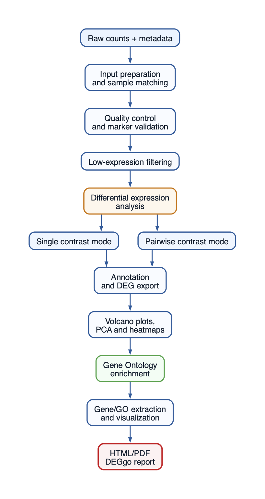

# DEGgo

- [Overview](#overview)
- [Workflow](#workflow)
- [Installation](#installation)
- [Quick start](#quick-start)
  - [Example dataset: airway](#example-dataset-airway)
- [Main functions](#main-functions)
- [Supported organisms](#supported-organisms)
- [Documentation](#documentation)
- [Citation](#citation)
- [License](#license)


[](https://doi.org/10.5281/zenodo.20785178)


## Overview

DEGgo is an R package for automated bulk RNA-seq downstream analysis.

It provides an end-to-end workflow from raw count matrices and sample
metadata to:

- quality control;
- sample validation;
- differential expression analysis;
- Gene Ontology enrichment;
- publication-ready visualizations;
- automated HTML/PDF reporting.

DEGgo supports DESeq2, edgeR, and limma and is designed for both
bioinformaticians and experimental biologists.

## Workflow



## Installation

``` r


install.packages("remotes")
remotes::install_github("ymbouamboua/DEGgo")
```

``` r


library(DEGgo)
```

## Quick start

### Example dataset: airway

DEGgo provides a small DEGgo-ready example dataset derived from the
Bioconductor `airway` package. This dataset contains human RNA-seq count
data from airway smooth muscle cells treated with dexamethasone.

``` r


counts <- read.delim(
  system.file("extdata", "airway_counts.tsv", package = "DEGgo"),
  check.names = FALSE
)

metadata <- read.delim(
  system.file("extdata", "airway_metadata.tsv", package = "DEGgo"),
  check.names = FALSE
)

metadata$condition <- metadata$dex

results <- run_deggo(
  counts = counts,
  metadata = metadata,
  gene_col = "gene_id",
  organism = "human",
  sample_col = "Run",
  method = "DESeq2",
  analysis_mode = "single",
  design_formula = ~ cell + dex,
  contrast = c("dex", "trt", "untrt"),
  output_dir = "DEGgo_airway",
  generate_report = TRUE,
  report_formats = "html"
)

results$summary
```

The analysis generates differential expression results, significant DEG
tables, volcano plots, PCA plots, heatmaps, Gene Ontology enrichment
results, and an HTML report in the DEGgo_airway directory.

## Main functions

| Function | Description |
|----|----|
| [`explore_bulk_rnaseq()`](https://ymbouamboua.github.io/DEGgo/reference/explore_bulk_rnaseq.md) | Raw and cleaned RNA-seq quality control |
| [`remove_flagged_samples()`](https://ymbouamboua.github.io/DEGgo/reference/remove_flagged_samples.md) | Remove failed or low-quality samples |
| [`marker_score_check()`](https://ymbouamboua.github.io/DEGgo/reference/marker_score_check.md) | Tissue marker scoring and sample swap detection |
| [`plot_gene_heatmap()`](https://ymbouamboua.github.io/DEGgo/reference/plot_gene_heatmap.md) | Marker or selected-gene heatmap |
| [`run_deggo()`](https://ymbouamboua.github.io/DEGgo/reference/run_deggo.md) | Main DEGgo differential expression workflow |
| [`run_go_enrichment()`](https://ymbouamboua.github.io/DEGgo/reference/run_go_enrichment.md) | Gene Ontology enrichment for DEG results |
| [`plot_go_terms()`](https://ymbouamboua.github.io/DEGgo/reference/plot_go_terms.md) | Publication-ready GO plot |
| [`plot_all_go_terms()`](https://ymbouamboua.github.io/DEGgo/reference/plot_all_go_terms.md) | Plot GO terms across multiple comparisons |
| [`extract_expression()`](https://ymbouamboua.github.io/DEGgo/reference/extract_expression.md) | Extract raw, normalized, log2-normalized or VST expression values |
| [`plot_gene_expression()`](https://ymbouamboua.github.io/DEGgo/reference/plot_gene_expression.md) | Plot normalized gene expression for selected genes |
| [`generate_deggo_report()`](https://ymbouamboua.github.io/DEGgo/reference/generate_deggo_report.md) | Generate HTML/PDF DEGgo report |
| [`deggo_extract_deg_genes()`](https://ymbouamboua.github.io/DEGgo/reference/deggo_extract_deg_genes.md) | Extract genes of interest from DEG results |
| [`deggo_extract_go_genes_pairwise()`](https://ymbouamboua.github.io/DEGgo/reference/deggo_extract_go_genes_pairwise.md) | Extract GO terms containing selected genes |
| [`deggo_extract_go_keywords()`](https://ymbouamboua.github.io/DEGgo/reference/deggo_extract_go_keywords.md) | Extract GO terms matching biological keywords |

## Supported organisms

DEGgo provides built-in annotation support for the following organisms:

| Organism                  | Parameter | OrgDb package  |
|:--------------------------|:----------|:---------------|
| Human (*Homo sapiens*)    | `"human"` | `org.Hs.eg.db` |
| Mouse (*Mus musculus*)    | `"mouse"` | `org.Mm.eg.db` |
| Rat (*Rattus norvegicus*) | `"rat"`   | `org.Rn.eg.db` |

Custom organisms are supported through user-supplied Bioconductor OrgDb
annotation databases.

## Documentation

The complete DEGgo tutorial and advanced workflows are available in the
package vignette:

``` r


browseVignettes("DEGgo")
```

## Citation

If you use DEGgo, please cite:

Yvon Mbouamboua. (2026).  
DEGgo: automated bulk RNA-seq differential expression analysis and Gene
Ontology enrichment.  
Zenodo.  
<https://doi.org/10.5281/zenodo.20785178>

# License

MIT © Yvon MBOUAMBOUA
